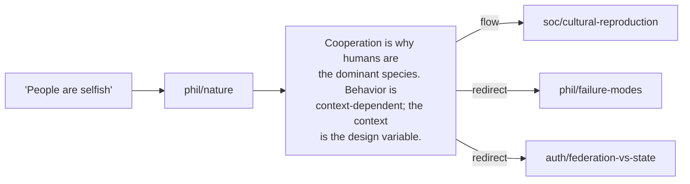

<p align="center">
  <picture>
    <source media="(prefers-color-scheme: dark)" srcset="https://retflo.org/img/readme/logo-dark.svg" />
    
  </picture>
</p>

<p align="center">
  <a href="https://retflo.org/license/"></a>
  <a href="https://retflo.org/nodes/"></a>
  <a href="https://retflo.org/nodes/"></a>
  <a href="https://retflo.org/nodes/"></a>
  <a href="https://retflo.org"></a>
</p>

<p align="center">
  Find out if you're right.<br>
  66 argument nodes across 7 domains, connected by typed edges. Point an LLM at it and argue.
</p>

<table>
<tr>
<td></td>
<td></td>
</tr>
<tr>
<td colspan="2"><em>Left: the graph in the <a href="https://retflo.org/visualizer/">interactive visualizer</a>. Right: retflo loaded as a skill in Claude Code.</em></td>
</tr>
</table>

## What this is

A map of the argument space around cooperative governance. 66 nodes across 7 domains, joined by six kinds of typed edge: flow, escalation, redirect, resolution, premise, retreat.

An objection routes to the node that handles it, that node routes to the next move, and the exchange keeps going until it reaches an end. Most political arguments never reach one.

The strongest opposing arguments are in the graph at full strength. When the framework loses on the merits, the correction goes into the public record.

## Try it

- [**Explore the graph**](https://retflo.org/visualizer/): interactive, no setup
- [**Read the arguments**](https://retflo.org/nodes/): browse by domain
- [**Tell any LLM**](https://retflo.org/agents) to read `retflo.org/agents`, then argue with it
- [**Install as a skill**](#install) for your coding agent
- [**Run the MCP server**](server/README.md) for graph tools and a live traversal viewer

## Install

```bash
npx skills add retflo/retflo -g
```

Auto-detects your agent. Target a specific one with `-a`:

```bash
npx skills add retflo/retflo -g -a claude-code
npx skills add retflo/retflo -g -a cursor
npx skills add retflo/retflo -g -a gemini-cli
```

40+ agents supported. Run `npx skills add retflo/retflo --list` to see all.

For manual installation and other methods, see the [install docs](https://retflo.org/docs/install/).

This repo contains the nodes, routing table, and engagement rules: everything an LLM needs to navigate the framework. Also available through the [website](https://retflo.org), the [API](https://retflo.org/docs/api-reference/), and the [visualizer](https://retflo.org/visualizer/).

## How it works

[`AGENTS.md`](AGENTS.md) is the entry point. It carries the routing table that maps common objections to nodes, plus the engagement rules and delivery calibration.

Each node has:
- **Position**: the substantive case
- **Objection handling**: a Move / Response / Concession table, with every concession tagged **Fact**, **Frame**, or **Contested**
- **Typed connections**: edges to the nodes that come next, across domains

Nodes are patterns. "China has a navy" and "Russia has nukes" route to the same node: external military threat.

### The chain in action



Objection in, structural response out, next move available. The graph is closed: follow any objection far enough and it routes back to territory the framework already covers.

## Domains

| Domain | Covers |
|--------|--------|
| Authority | State, governance, federation, enforcement, democracy, defense |
| Economics | Property, labor, markets, cooperatives, inequality, trade, commons |
| History | Revolutions, Mondragon, kibbutzim, Rojava, colonialism |
| Philosophy | Human nature, coercion, freedom, transition, direct action |
| Rhetoric | Framing, fallacies, burden of proof, debate tactics |
| Social | Structural oppression, propaganda, nationalism, education |
| Technology | Platform ownership, algorithmic governance |

## Structure

```
retflo/
├── AGENTS.md            ← framework entry point
├── OPERATORS.md         ← the material read, applied before any node
├── SKILL.md             ← skill ecosystem compatibility
├── STYLE-GUIDE.md       ← delivery calibration
├── CLOSE-CONDITIONS.md  ← argument endpoint procedures
├── server/              ← local MCP server and traversal viewer
└── nodes/
    ├── auth/            ← Authority & Governance
    ├── econ/            ← Economics & Ownership
    ├── hist/            ← Historical Cases
    ├── phil/            ← Philosophy
    ├── rhet/            ← Rhetoric & Tactics
    ├── soc/             ← Social Issues
    └── tech/            ← Technology
```

## License

[Retflo Cooperative Commons License (RCCL) v1.0](https://retflo.org/license/): free for individuals, worker cooperatives, and democratic organizations. Commercial licensing available for investor-owned entities.

---

[retflo.org](https://retflo.org) · [Visualizer](https://retflo.org/visualizer/) · [Docs](https://retflo.org/docs/install/) · [API](https://retflo.org/docs/api-reference/) · [FAQ](https://retflo.org/faq/) · [Contact](mailto:contact@retflo.org)

© 2026 retflo™ contributors. Licensed under [RCCL v1.0](https://retflo.org/license/).

[](https://ko-fi.com/retflo)
